# 1. Deployment Tutorial

## 1.1 Install IDE

We recommend installing Xcode for the development and deployment of this iOS project. Here's why:

- **Official Tool**: Xcode is the official development environment provided by Apple for macOS, iOS, watchOS, and tvOS applications. 

- **Integrated Environment**: Xcode offers a complete, unified suite of development tools, including an advanced editor, visual UI designer (Interface Builder), and a powerful debugger.


To get started, [download Xcode from the Mac App Store](https://apps.apple.com/us/app/xcode/id497799835).

## 1.2 Import Project
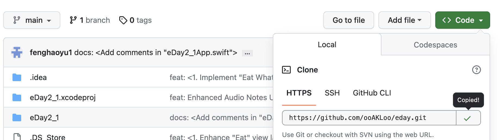
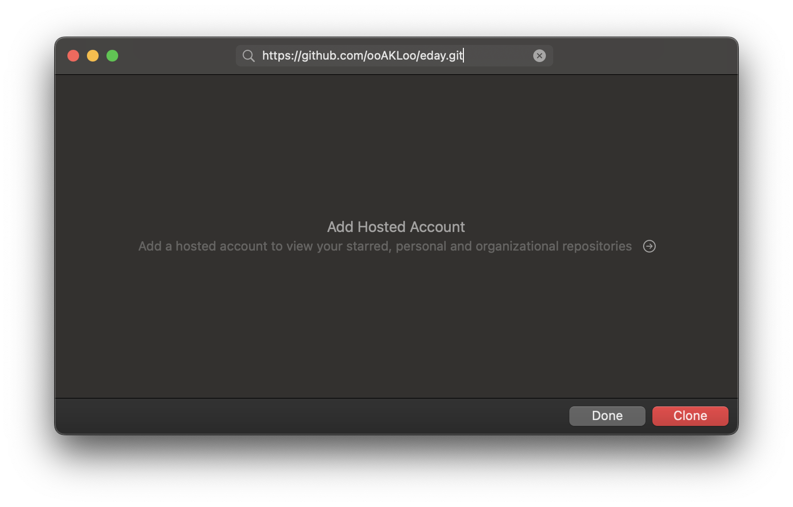

After intalling Xcode, Clone Project Git Repository.

## 1.3 Install IOS SDK Version
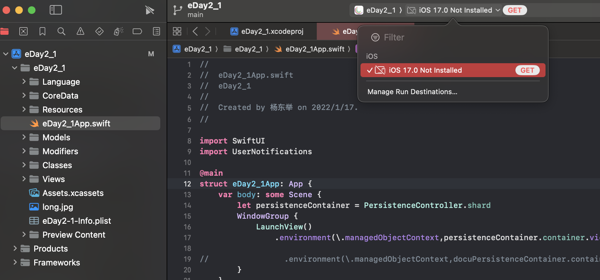

1. In the top toolbar of Xcode, you'll see a dropdown menu displaying the currently selected iOS SDK version. For instance, the image shows "iOS 17.0 Not Installed".

2. Click on this dropdown menu. If you haven't installed the iOS version required for the current project, you'll see a "GET" button, as indicated by the red button in the image.

3. Click the "GET" button to download and install the necessary iOS SDK version.


## 1.4 Run Project
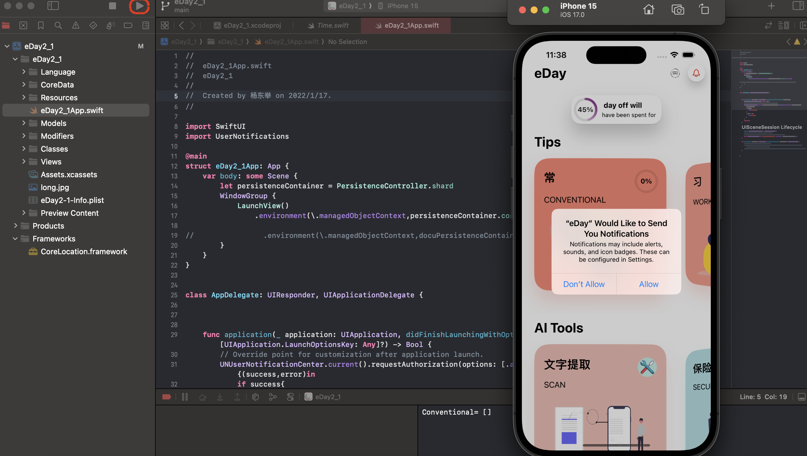

When we install IOS SDK successfully, we can run now!

## 1.5 Git Operation

### 1.5.1 Pull
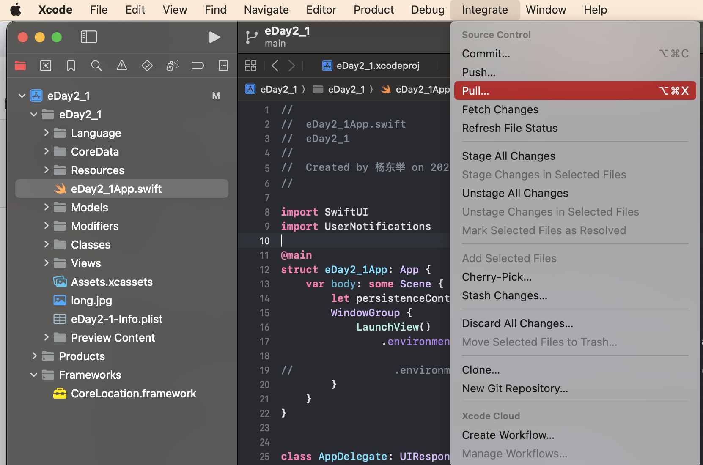 

Before you begin developing, ensure that your local project is up-to-date with the version on GitHub. This ensures that you are working with the most recent changes and reduces the risk of conflicts.

### 1.5.2 Stage
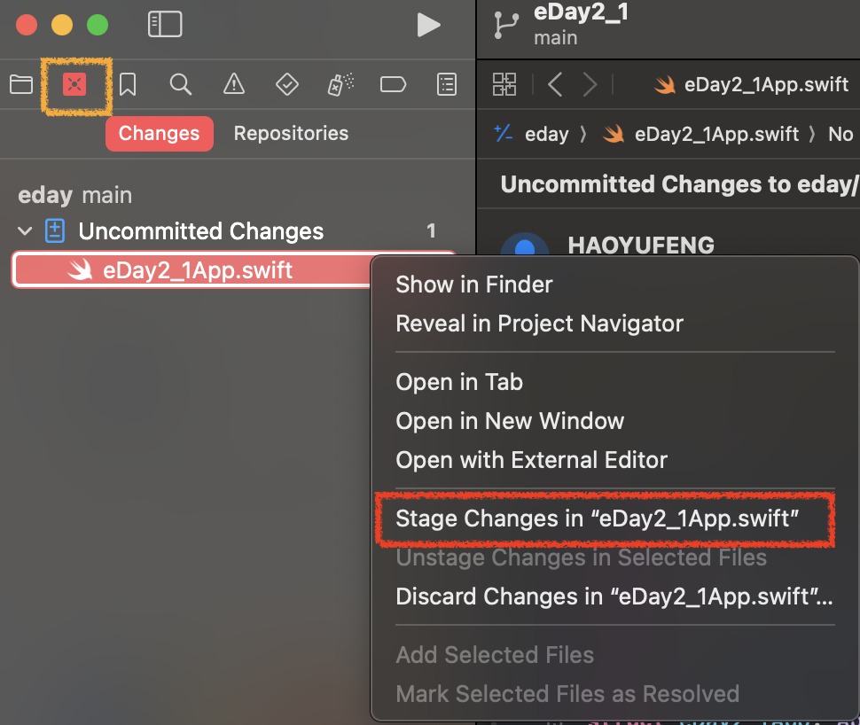 
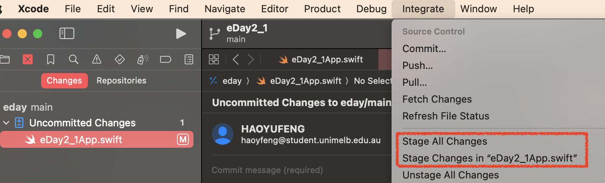 

After making changes to your code, you'll need to stage these changes before committing. 

### 1.5.3 Commmit
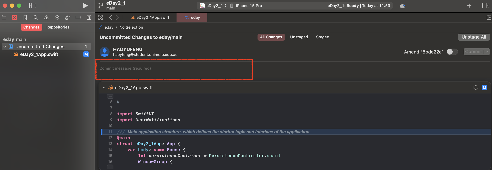 
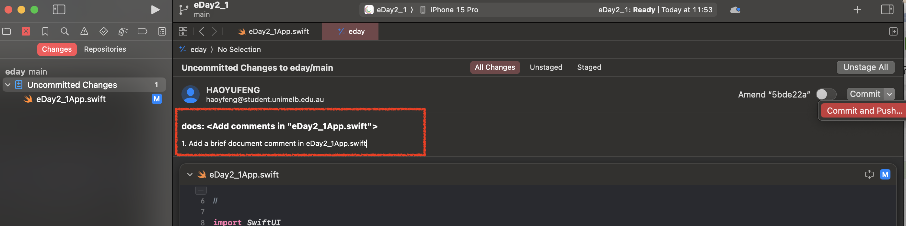 

Once you've staged your changes, you must implement the content of commit, please check the [commit message rule](#2-git-commit-message-guidelines).

### 1.5.4 Push
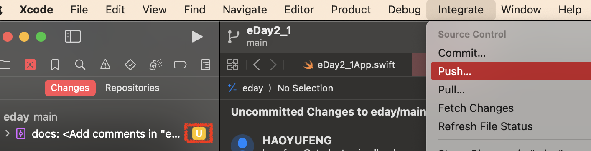

After committing, you can push your changes to the GitHub repository.
- You can click the yellow "U" button to push.
- You can also push by clicking "Integrate" dropdown menu to push.

### 1.5.5 Outcome
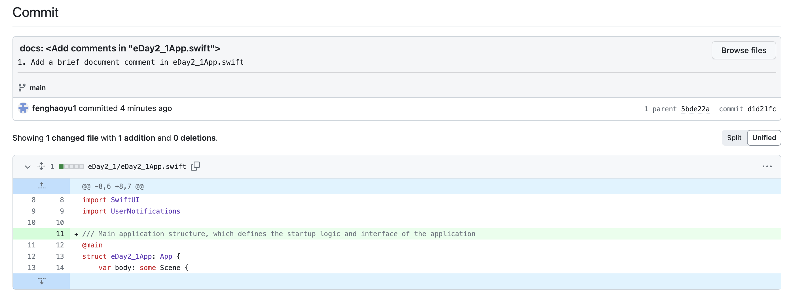

Now we can check the outcome on Github.
Enjoy it!


# 2. Git Commit Message Guidelines

We've established these guidelines to ensure Git commit records are clear and orderly. All team members should follow them.

## 2.1 Commit Message Structure

Each commit message should have a header and a body. The header should be brief and clear, not exceeding 50 characters. The body provides a detailed description of changes and can span multiple lines, each under 72 characters.

Format of a commit message:

`<type>` : `<subject>`

`<body>` 

Replace `<type>`, `<subject>`, and `<body>` with your content.

eg:

feat: Enhanced Audio Notes UI & Improved Bilingual Support
1. Refined the UI of the Audio Notes feature for better user experience and clarity.
2. Optimized animation displays within the Audio Notes feature, providing smoother visual transitions.
### Type

Commit types include:

- `feat`: New feature
- `fix`: Bug fix
- `docs`: Documentation
- `style`: Format changes (do not affect code execution)
- `refactor`: Refactor (code changes not related to new features or bug fixes)
- `test`: Added tests
- `chore`: Build process or auxiliary tool changes

If `type` is `feat` or `fix`, the commit appears in the Change log. For other types, it's your decision to include them in the Change log.

### Subject

`<subject>` is a brief change description, under 50 characters.

Rules:

- Start with a verb in the first person present tense, e.g., `change`, not `changed` or `changes`
- Begin with a lowercase letter
- Don't end with a period

### Body

`<body>` is a detailed change description and can span multiple lines.

Rules:

- Use the first person present tense, e.g., `change`, not `changed` or `changes`
- Explain the reason for the code changes and compare with the previous behavior

# 3. Pull Request Process

1. Submit a Pull Request to the main repository on GitHub.
2. After code review, your changes are accepted and merged into the main repository.

# 4. Git Merge Process

To merge code from the remote `dev_ydj` branch into the remote `main` branch, follow these steps:

1. Ensure you're on the main branch of the local repository. If not, switch to it:

    ```
    git checkout main
    ```
    
2. Pull the latest code from the remote `main` branch to ensure your local branch is updated:

    ```
    git pull origin main
    ```
    
3. Merge the remote `dev_ydj` branch code into the local main branch:

    ```
    git merge dev_ydj
    ```
    
4. If there are conflicts, resolve them and commit the changes.
5. Push the changes of the local main branch to the remote `main` branch:

    ```
    git push origin main
    ```
    

This merges the code from your remote `dev_ydj` branch into the remote `main` branch.

Note: The steps above assume you've added the remote repository as `origin`. If not, replace `origin` in the commands with your remote repository name. Always backup important code before these operations.
